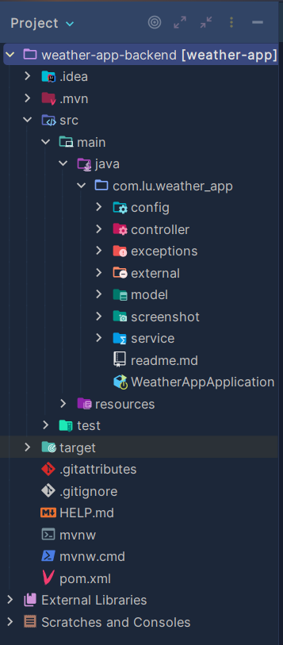
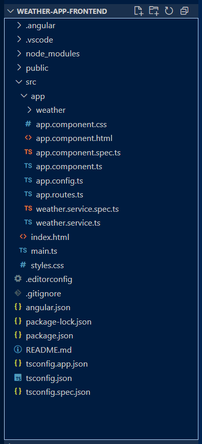
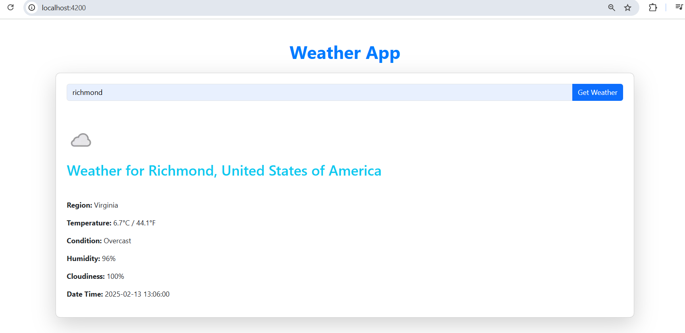
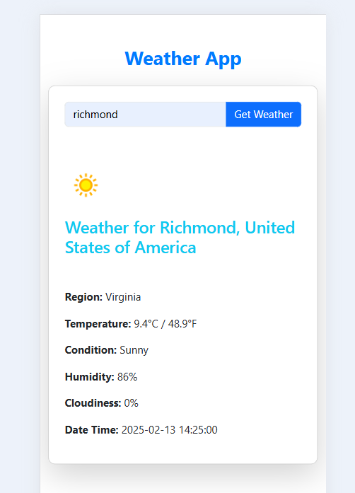

<h1 align="center">🌦️ WeatherApp - Aplicación del Clima</h1>

<h2>📋 Descripción</h2>

WeatherApp es una aplicación que permite, mediante un formulario de búsqueda por ciudad, consultar información meteorológica en tiempo real.

<h2>🏗️ Está compuesta por:</h2>
<ul>
  <li><b>Backend</b>: API RESTful en Spring Boot, que actúa como un proxy para consumir la API externa del clima utilizando WebClient de Spring WebFlux.</li>
  <li><b>Frontend</b>: Aplicación desarrollada en Angular para mostrar la información meteorológica al usuario.</li>
</ul>

<h2>🛠️ Tecnologías utilizadas</h2>
<h3>Backend</h3>
<ul>
  <li>Spring Boot 3.4.2</li>
  <li>Maven (para la gestión de dependencias y construcción del proyecto)</li>
  <li>Spring WebFlux (WebClient)</li>
  <li>API externa: <a href="https://www.weatherapi.com/">WeatherAPI</a></li>
  <li>Java 21</li>
</ul>

<h3>Frontend</h3>
<ul>
  <li>Angular 18.2.14 (Standalone)</li>
  <li>TypeScript 5.5.4</li>
  <li>RxJS 7.8.1</li>
  <li>Zone.js 0.14.10</li>
  <li>HTML5, CSS3</li>
  <li>Bootstrap</li>
</ul>

<h2>🔧 Herramientas adicionales</h2>
<ul>
  <li>Angular CLI 18.2.14</li>
  <li>Node.js 16.13.1</li>
  <li>npm 8.1.2</li>
  <li>Visual Studio Code</li>
  <li>PowerShell</li>
  <li>Postman</li>
  <li>Git</li>
  <li>NotePad++</li>
</ul>

<h2>✨ Características</h2>
<ul>
  <li>Consulta del clima deseado, por ciudad.</li>
  <li>Visualización de temperatura, humedad, fecha, hora, etc.</li>
  <li>Arquitectura basada en microservicios (backend separado del frontend).</li>
  <li>Comunicación backend-frontend mediante API RESTful.</li>
  <li>Diseño responsive.</li>
</ul>

<h2>📖 Cómo usar</h2>

<h3>1️⃣ Clona el repositorio</h3>
<pre><code>git clone https://github.com/lucyfc-999/weather-app.git</code></pre>

<h3>2️⃣ Backend: Ejecutar el API RESTful</h3>
<ol>
  <li>Ve a la carpeta <code>backend</code>:</li>
  <pre><code>cd weather-app-backend</code></pre>
  
  <li>Instala las dependencias y ejecuta el proyecto con Maven:</li>
  <pre><code>mvn clean install
mvn spring-boot:run</code></pre>
</ol>

<h3>3️⃣ Frontend: Ejecutar la aplicación Angular</h3>
<ol>
  <li>Ve a la carpeta <code>frontend</code>:</li>
  <pre><code>cd weather-app-frontend</code></pre>
  
  <li>Instala las dependencias y ejecuta la aplicación:</li>
  <pre><code>npm install
ng serve</code></pre>
  
  <li>Abre el navegador en <code>http://localhost:4200</code>.</li>
</ol>

<h2>📸 Capturas de Pantalla</h2>

    

    

    

    

<h2>🖋️  Desarrollador</h2>
<ul>
  <li><a href="https://github.com/lucyfc-999">lucyfc-999</a></li>
</ul>

